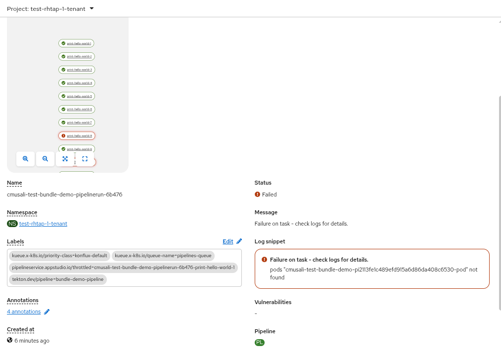

# Observations While Creating and Running Multiple PipelineRuns in Parallel

This document summarizes my observations while creating and executing a large number of PipelineRuns under different scenarios within a short period of time. In other words, this testing was focused on running many pipelines in parallel.

## Summary

### TL;DR

Git Resolver is reliable at small scale but fails under heavy parallel load when the `revision` is set to a branch name instead of a commit hash. Setting the `revision` value to a commit SHA while using the Git Resolver improves stability when applied consistently across all references. This improves scalability because using a commit hash allows Tekton to cache resolved resources, since the revision becomes immutable and identical requests can reuse previously fetched pipeline and task definitions instead of repeatedly cloning and resolving Git content. The Bundle Resolver shows similar or slightly better behavior  under high concurrency.

# Scenario 1: Using Tekton Git Resolver to Reference Pipeline and Task Definitions Stored in a Git Repository

## Attempt 1

Created a PipelineRun that references a pipeline definition stored in a Git repository. The pipeline contains task specifications (`taskSpecs`) defined directly inside the pipeline.

### Observation

All 50 pipelines executed successfully and completed without any errors.

## Attempt 2

Created a PipelineRun that references a pipeline definition stored in a Git repository. The pipeline contains only one task, and the task itself is referenced using the Git resolver.

### Observation

All 50 pipelines executed successfully and completed without any errors.

## Attempt 3

Created a PipelineRun that references a pipeline definition stored in a Git repository. The pipeline contains 15 tasks, and each task is referenced using the Git resolver. **This is similar to RPM build pipeline**

### Observation

- In the first round, 50 pipelines were launched in parallel.
- All 50 pipelines executed successfully and completed without any errors.

### Second Round Observation

- In the second round, 100 pipelines were launched in parallel.
- Around 80% of the pipelines failed with the following errors:

        message: |-
        Pipeline test-rhtap-1-tenant/ can't be Run; it contains Tasks that don't exist: Couldn't retrieve Task "resolver type git\nurl = https://github.com/mcharanrm/tekton-resolver-benchmarks.git\n": error requesting remote resource: error getting "Git" "test-rhtap-1-tenant/git-b90df41a5398b7dece615d3e3f5083d1": error resolving repository: git clone error: Cloning into '/tmp/tekton-resolver-benchmarks.git-3688497856'...
        fatal: unable to access 'https://github.com/mcharanrm/tekton-resolver-benchmarks.git/': The requested URL returned error: 403: exit status 128
        reason: CouldntGetTask  
     

        ⬢ [cmusali@toolbx tekton-resolver-benchmarks]$ oc get pipelineruns -n test-rhtap-1-tenant | grep -i 'False'
        cmusali-test-pipeline-run-2bk8w   False       CouldntGetTask       66s         62s
        cmusali-test-pipeline-run-2gk6v   False       CouldntGetPipeline   63s         63s
        cmusali-test-pipeline-run-2mwsw   False       CouldntGetTask       64s         63s
        cmusali-test-pipeline-run-2n4kq   False       CouldntGetTask       64s         63s
        cmusali-test-pipeline-run-2sdsw   False       CouldntGetPipeline   60s         60s
        cmusali-test-pipeline-run-46l5j   False       CouldntGetPipeline   62s         61s
        cmusali-test-pipeline-run-47zsf   False       CouldntGetPipeline   62s         62s
        cmusali-test-pipeline-run-4n5kl   False       CouldntGetTask       66s         62s
        cmusali-test-pipeline-run-5sw92   False       CouldntGetPipeline   61s         61s
        cmusali-test-pipeline-run-685f2   False       CouldntGetTask       70s         62s
        cmusali-test-pipeline-run-6gt55   False       CouldntGetTask       68s         62s
        cmusali-test-pipeline-run-6qpgl   False       CouldntGetPipeline   63s         63s
        cmusali-test-pipeline-run-6v4kv   False       CouldntGetTask       70s         62s
        cmusali-test-pipeline-run-6z2j4   False       CouldntGetPipeline   63s         63s
        cmusali-test-pipeline-run-866hs   False       CouldntGetTask       72s         60s
        cmusali-test-pipeline-run-8g2jr   False       CouldntGetTask       65s         63s
        cmusali-test-pipeline-run-8nlg5   False       CouldntGetPipeline   61s         61s
        cmusali-test-pipeline-run-9bx5g   False       CouldntGetTask       67s         61s
        cmusali-test-pipeline-run-b64hb   False       CouldntGetPipeline   60s         60s
        cmusali-test-pipeline-run-bll7w   False       CouldntGetTask       67s         62s
        cmusali-test-pipeline-run-cnz2p   False       CouldntGetTask       67s         62s
        cmusali-test-pipeline-run-d9zxt   False       CouldntGetTask       72s         60s
        cmusali-test-pipeline-run-dcxrb   False       CouldntGetTask       69s         61s
        cmusali-test-pipeline-run-dxb5x   False       CouldntGetTask       73s         60s
        cmusali-test-pipeline-run-f95nh   False       CouldntGetTask       69s         62s
        cmusali-test-pipeline-run-fk4lq   False       CouldntGetTask       67s         63s
        cmusali-test-pipeline-run-fsvqs   False       CouldntGetPipeline   61s         61s
        cmusali-test-pipeline-run-g2cl5   False       CouldntGetPipeline   60s         60s
        cmusali-test-pipeline-run-g95rp   False       CouldntGetPipeline   59s         59s
        cmusali-test-pipeline-run-gf7r4   False       CouldntGetPipeline   62s         62s
        cmusali-test-pipeline-run-gh9nl   False       CouldntGetTask       65s         62s
        cmusali-test-pipeline-run-h4gh6   False       CouldntGetPipeline   61s         61s
        cmusali-test-pipeline-run-h9wpb   False       CouldntGetTask       68s         62s
        cmusali-test-pipeline-run-hk64f   False       CouldntGetTask       68s         62s
        cmusali-test-pipeline-run-hn4hh   False       CouldntGetTask       68s         62s
        cmusali-test-pipeline-run-k8d2d   False       CouldntGetTask       71s         61s
        cmusali-test-pipeline-run-kj4j6   False       CouldntGetTask       71s         61s
        cmusali-test-pipeline-run-kwdp9   False       CouldntGetPipeline   61s         61s
        cmusali-test-pipeline-run-kzqfw   False       CouldntGetTask       69s         62s
        cmusali-test-pipeline-run-l2q2m   False       CouldntGetTask       65s         63s
        cmusali-test-pipeline-run-l846b   False       CouldntGetTask       73s         61s
        cmusali-test-pipeline-run-lzp7f   False       CouldntGetTask       73s         61s
        cmusali-test-pipeline-run-mb2sl   False       CouldntGetTask       70s         62s
        cmusali-test-pipeline-run-mb6sd   False       CouldntGetTask       66s         63s
        cmusali-test-pipeline-run-mjnhh   False       CouldntGetPipeline   59s         59s
        cmusali-test-pipeline-run-n2jgr   False       CouldntGetPipeline   60s         60s
        cmusali-test-pipeline-run-n76zh   False       CouldntGetTask       73s         60s
        cmusali-test-pipeline-run-pchrp   False       CouldntGetTask       63s         61s
        cmusali-test-pipeline-run-pfgl2   False       CouldntGetPipeline   62s         62s
        cmusali-test-pipeline-run-qmczv   False       CouldntGetPipeline   63s         63s
        cmusali-test-pipeline-run-qnqtb   False       CouldntGetTask       70s         62s
        cmusali-test-pipeline-run-r4q8z   False       CouldntGetTask       66s         62s
        cmusali-test-pipeline-run-rfvtd   False       CouldntGetTask       67s         62s
        cmusali-test-pipeline-run-rm29m   False       CouldntGetTask       66s         62s
        cmusali-test-pipeline-run-s4dp8   False       CouldntGetTask       72s         60s
        cmusali-test-pipeline-run-sz7ql   False       CouldntGetTask       73s         62s
        cmusali-test-pipeline-run-t2mcs   False       CouldntGetPipeline   60s         60s
        cmusali-test-pipeline-run-t45vm   False       CouldntGetTask       68s         62s
        cmusali-test-pipeline-run-tm4hw   False       CouldntGetTask       72s         61s
        cmusali-test-pipeline-run-tnzgx   False       CouldntGetTask       65s         63s
        cmusali-test-pipeline-run-trcqt   False       CouldntGetTask       72s         61s
        cmusali-test-pipeline-run-v82hq   False       CouldntGetPipeline   63s         63s
        cmusali-test-pipeline-run-v954r   False       CouldntGetTask       71s         62s
        cmusali-test-pipeline-run-vhz2j   False       CouldntGetTask       73s         61s
        cmusali-test-pipeline-run-vkqjv   False       CouldntGetTask       64s         62s
        cmusali-test-pipeline-run-vn52g   False       CouldntGetTask       70s         61s
        cmusali-test-pipeline-run-vq8nj   False       CouldntGetTask       64s         63s
        cmusali-test-pipeline-run-vrrxg   False       CouldntGetPipeline   59s         59s
        cmusali-test-pipeline-run-vxkzf   False       CouldntGetTask       65s         63s
        cmusali-test-pipeline-run-vxs7p   False       CouldntGetTask       71s         61s
        cmusali-test-pipeline-run-w9l4w   False       CouldntGetTask       69s         61s
        cmusali-test-pipeline-run-wc2cn   False       CouldntGetPipeline   59s         59s
        cmusali-test-pipeline-run-wcc57   False       CouldntGetTask       71s         62s
        cmusali-test-pipeline-run-xffnv   False       CouldntGetTask       72s         61s
        cmusali-test-pipeline-run-z6h5t   False       CouldntGetTask       73s         61s
        cmusali-test-pipeline-run-zc5b4   False       CouldntGetPipeline   62s         62s
        cmusali-test-pipeline-run-zk5bq   False       CouldntGetPipeline   59s         59s
        cmusali-test-pipeline-run-zlcw2   False       CouldntGetPipeline   58s         58s
        cmusali-test-pipeline-run-znvwl   False       CouldntGetTask       73s         61s
        cmusali-test-pipeline-run-zsvxj   False       CouldntGetTask       69s         62s
     

# Scenario 2: Using Tekton Git Resolver with Commit Hash Revisions

The `CouldntGetPipeline` and `CouldntGetTask` errors were successfully reproduced. The next step was to test the suggestions intended to improve performance and reduce these failures.

The recommendation was to use a commit hash in the `revision` parameter instead of a branch name such as `master`. Tekton caching only works when the revision is set to a commit hash, which allows resolved resources to be cached and can improve performance.

## Attempt 1

Updated the `revision` parameter from `master` to a commit hash only in the PipelineRun YAML file.

### Observation

100 PipelineRuns were created, and almost all of them failed, similar to the previous scenario. Most (or all) of the failures were due to `CouldntGetPipeline` or `CouldntGetTask` errors.

## Attempt 2

Updated the `revision` parameter to use the same commit hash in all places where the Git Resolver was used, not just in the PipelineRun YAML file.

### Observation

Most of the PipelineRuns, around 97%, executed successfully and completed without any errors. The remaining failures were not related to `CouldntGetPipeline` or `CouldntGetTask` errors.

        ⬢ [cmusali@toolbx tekton-resolver-benchmarks]$ oc get pipelineruns -n test-rhtap-1-tenant  | grep 'True' |wc
            93     465    6972

 

        ⬢ [cmusali@toolbx tekton-resolver-benchmarks]$ oc get pipelineruns -n test-rhtap-1-tenant  | grep 'False' 
        cmusali-test-pipeline-run-8gtqq   False       Failed      3m21s       80s
        cmusali-test-pipeline-run-drjkm   False       Failed      3m45s       3m23s
        cmusali-test-pipeline-run-pcxc7   False       Failed      3m18s       74s

# Scenario 3: Using Tekton Bundle Resolver to Reference Pipeline and Task Definitions Stored in a Tekton bundle on a OCI Image Repository

**Note: The bundles were pulled using tags instead of image digests.**

## Attempt 1

Created 100 PipelineRuns that reference a pipeline definition stored in a Tekton bundle on an OCI image repository. The pipeline contains only one task, and the task is defined inside the `pipelineSpec`.

    ⬢ [cmusali@toolbx tekton-resolver-benchmarks]$ tkn bundle push quay.io/cmusali/tekton-bundle-resolver-benchmarks:latest -f /home/cmusali/RedHatProjects/tekton-resolver-benchmarks/pipeline/bundle-demo-pipeline.yaml --remote-username cmusali --remote-password *****

    *Warning*: This is an experimental command, its usage and behavior can change in the next release(s)
    Creating Tekton Bundle:
        - Added Pipeline: bundle-demo-pipeline to image

    Pushed Tekton Bundle to quay.io/cmusali/tekton-bundle-resolver-benchmarks@sha256:566aeba96bc448853fa5417467473e9af483ac52ed39e778c7d8f68d3b18a7d4

### Observation

All 100 pipelines executed successfully and completed without any errors.

## Attempt 2

Extended the pipeline to include 15 additional tasks, with each task referenced using the bundle resolver. After updating and adding it to the bundle, 100 PipelineRuns were created again in parallel.

    ⬢ [cmusali@toolbx tekton-resolver-benchmarks]$ tkn bundle push quay.io/cmusali/tekton-bundle-resolver-benchmarks:latest -f /home/cmusali/RedHatProjects/tekton-resolver-benchmarks/pipeline/bundle-demo-pipeline.yaml -f /home/cmusali/RedHatProjects/tekton-resolver-benchmarks/tasks/bundle-demo-task.yaml --remote-username cmusali --remote-password *****
    *Warning*: This is an experimental command, its usage and behavior can change in the next release(s)
    Creating Tekton Bundle:
        - Added Pipeline: bundle-demo-pipeline to image
        - Added Task: bundle-demo-task to image

    Pushed Tekton Bundle to quay.io/cmusali/tekton-bundle-resolver-benchmarks@sha256:c2153069808d0545cc49bc04369d95a19ae285133dbdfe53e63cd9057850cd60

### Observation

All PipelineRuns, except the 10 failed builds, executed successfully and completed without any errors. The failures from those 10 builds were not related to `CouldntGetPipeline` or `CouldntGetTask` errors. 

The errors from the 10 failed builds were related to `Failure on Task - Pod not found`.

    ⬢ [cmusali@toolbx tekton-resolver-benchmarks]$ oc get pipelineruns -n test-rhtap-1-tenant | grep -i 'False' 
    cmusali-test-bundle-demo-pipelinerun-55l2q   False       Failed                2m30s       27s
    cmusali-test-bundle-demo-pipelinerun-6b476   False       Failed                2m19s       17s
    cmusali-test-bundle-demo-pipelinerun-fh8ck   False       Failed                2m46s       2m9s
    cmusali-test-bundle-demo-pipelinerun-jv8nc   False       Failed                2m43s       2m11s
    cmusali-test-bundle-demo-pipelinerun-n6jwn   False       Failed                2m21s       30s
    cmusali-test-bundle-demo-pipelinerun-nxbvg   False       Failed                2m20s       26s
    cmusali-test-bundle-demo-pipelinerun-rmsx8   False       Failed                2m46s       2m32s
    cmusali-test-bundle-demo-pipelinerun-w8qmr   False       Failed                2m19s       18s
    cmusali-test-bundle-demo-pipelinerun-x8qxr   False       Failed                2m47s       2m11s
 

# Summary

## Key Observations

Git Resolver works fine for 50 parallel PipelineRuns, but failures appear when scaling to 100 runs with multiple remote task resolutions.

Main failures include `CouldntGetPipeline`, `CouldntGetTask`, and occasional Git clone `403` errors.

---

## Impact of Using Commit SHA for Revisions

Using a commit SHA instead of a branch helps only when it is applied consistently across all Git Resolver references.

When done correctly, around 97% of PipelineRuns succeeded and resolver-related errors were completely gone.

---

## Tekton Bundle Resolver Observations

Bundle Resolver handled high parallel workloads better than Git Resolver, even with multiple tasks resolved from the bundle.

Failures observed were not resolver-related and were instead due to `Pod not found`.

---

## Overall Conclusion

Git Resolver is suitable for smaller workloads but struggles under high concurrency with many remote resolutions.

For better scalability and stability, use commit SHA consistently and prefer Bundle Resolver for large-scale executions.
