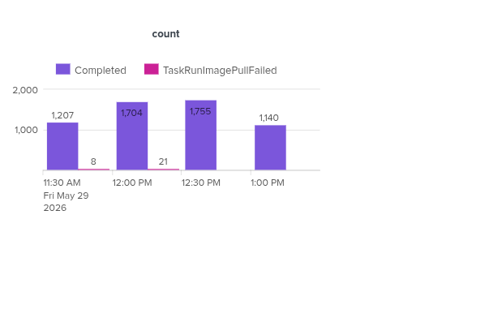

# Observations from Testing TaskRunImagePullFailed and ErrImagePull: pull QPS exceeded

In a 200-concurrent RPM build pipeline test, 9 builds failed with the error `TaskRunImagePullFailed`. Upon reviewing the status of the failed `PipelineRuns` and `TaskRuns`, the same error was observed across all failed builds.

    the step "use-trusted-artifact-results" in TaskRun "example-rok-libecpg-on-pull-request-xpxxz-rpmbuild-ppc64le" failed to pull the image "". The pod errored with the message: "Back-off pulling image "quay.io/konflux-ci/build-trusted-artifacts@sha256:90a188e90bf8f33cf93016bcfdfd0a3a9e7df6ff13691f001a0ed4f014060e2e": ErrImagePull: pull QPS exceeded."

## Recommendations

The Pipelines team provided recommendations to address the issue and improve overall cluster stability. As part of validating these recommendations, all individual pipeline steps need to be updated with `imagePullPolicy: IfNotPresent`. According to the documentation `imagePullPolicy` can only be added to a step when the step references a `StepAction`. I went through the `rpm-build-pipeline` repository and did not find any tasks where the steps reference a `StepAction`.

### What happens if I add it to the step anyway? Will it fail with an error?

1. I just created a `PipelineRun` where `imagePullPolicy: IfNotPresent` is set at the step level. The pipeline 
completed fine without any failures.

        ⬢ [cmusali@toolbx tekton-resolver-benchmarks]$ oc get pipelinerun/hello-world-pipelinerun-657s4 -n test-rhtap-1-tenant -o json | jq '.spec.pipelineSpec'
        {
        "tasks": [
            {
            "name": "print-hello-world",
            "taskSpec": {
                "metadata": {},
                "spec": null,
                "steps": [
                {
                    "computeResources": {},
                    "image": "registry.access.redhat.com/ubi9/ubi-minimal:latest",
                    "imagePullPolicy": "IfNotPresent",
                    "name": "run-echo-cmd",
                    "script": "echo 'Hello World'"
                }
                ]
            }
            }
        ]
        }

Implementing this change would require updating the RPM build pipeline repository on GitHub, but we currently don’t have access to it. To proceed, we would need to fork the repository and make the necessary modifications.

In addition, running the RPM build pipeline tests is resource-intensive because they consume AWS virtual machine resources. Although the testing process itself is straightforward, it comes with infrastructure cost.

Also, these errors are not specific to the RPM build pipeline or Konflux controllers. They are related to Kubernetes and Pipelines in general. Because of this, I believe the issue can be reproduced using a simple pipeline, and the proposed fix can be validated without relying on the full RPM build pipeline setup.

So the plan is to reproduce `TaskRunImagePullFailed: ErrImagePull: pull QPS exceeded` errors with a simple pipeline that contains a couple of tasks, where each task basically sleeps for a few seconds and Verify Whether Setting `imagePullPolicy` on Steps Resolves Them

## Reproducing the Issue — Create and Run 200 PipelineRuns Concurrently

These errors were originally observed during the 200-build test. To reproduce the same scenario, we will create 200 PipelineRuns and verify whether a simple pipeline is sufficient to reproduce the issue on the Konflux cluster.

A total of 100 PipelineRuns were created in the `test-rhtap-1-tenant` namespace, and another 100 were created in the `test-rhtap-2-tenant` namespace. This was done to avoid hitting the `ResourceQuota` limits configured for a single namespace. Within a few seconds, all PipelineRuns were created and started running concurrently.

### Observations

The issue was successfully reproduced during the 200 PipelineRuns test. In total, around 29 TaskRuns across 22 PipelineRuns failed with the same error message.

#### Failed TaskRuns

    ⬢ [cmusali@toolbx tekton-resolver-benchmarks]$ oc get taskruns -n test-rhtap-1-tenant | grep -i 'False'
    hello-world-pipelinerun-27wx4-print-hello-world-13   False       TaskRunImagePullFailed   80s         59s
    hello-world-pipelinerun-27wx4-print-hello-world-14   False       TaskRunImagePullFailed   80s         62s
    hello-world-pipelinerun-5qfj7-print-hello-world-13   False       TaskRunImagePullFailed   2m25s       2m5s
    hello-world-pipelinerun-cm67m-print-hello-world-7    False       TaskRunImagePullFailed   2m27s       2m11s
    hello-world-pipelinerun-cwtg9-print-hello-world-11   False       TaskRunImagePullFailed   2m26s       2m10s
    hello-world-pipelinerun-gx8z8-print-hello-world-6    False       TaskRunImagePullFailed   81s         64s
    hello-world-pipelinerun-h5xr2-print-hello-world-13   False       TaskRunImagePullFailed   81s         64s
    hello-world-pipelinerun-k95d4-print-hello-world-1    False       TaskRunImagePullFailed   113s        94s
    hello-world-pipelinerun-q9b9f-print-hello-world-12   False       TaskRunImagePullFailed   110s        95s
    hello-world-pipelinerun-wdvsq-print-hello-world-14   False       TaskRunImagePullFailed   111s        93s
    hello-world-pipelinerun-wq4xn-print-hello-world-1    False       TaskRunImagePullFailed   83s         66s
 

    ⬢ [cmusali@toolbx tekton-resolver-benchmarks]$ oc get taskruns -n test-rhtap-2-tenant | grep -i 'False'
    hello-world-pipelinerun-5t5p6-print-hello-world-9    False       TaskRunImagePullFailed   3m32s       3m15s
    hello-world-pipelinerun-8bs4f-print-hello-world-13   False       TaskRunImagePullFailed   80s         60s
    hello-world-pipelinerun-dlxt9-print-hello-world-4    False       TaskRunImagePullFailed   82s         64s
    hello-world-pipelinerun-dlxt9-print-hello-world-7    False       TaskRunImagePullFailed   81s         61s
    hello-world-pipelinerun-dlxt9-print-hello-world-9    False       TaskRunImagePullFailed   80s         61s
    hello-world-pipelinerun-dnlcj-print-hello-world-4    False       TaskRunImagePullFailed   81s         63s
    hello-world-pipelinerun-f96p6-print-hello-world-7    False       TaskRunImagePullFailed   3m33s       3m13s
    hello-world-pipelinerun-ghnf8-print-hello-world-4    False       TaskRunImagePullFailed   2m26s       2m5s
    hello-world-pipelinerun-ghnf8-print-hello-world-5    False       TaskRunImagePullFailed   2m27s       2m5s
    hello-world-pipelinerun-ksvdm-print-hello-world-12   False       TaskRunImagePullFailed   81s         64s
    hello-world-pipelinerun-m44w5-print-hello-world-14   False       TaskRunImagePullFailed   81s         60s
    hello-world-pipelinerun-m44w5-print-hello-world-9    False       TaskRunImagePullFailed   80s         60s
    hello-world-pipelinerun-q7drx-print-hello-world-3    False       TaskRunImagePullFailed   2m27s       2m6s
    hello-world-pipelinerun-q7drx-print-hello-world-4    False       TaskRunImagePullFailed   2m27s       2m5s
    hello-world-pipelinerun-rwvcg-print-hello-world-11   False       TaskRunImagePullFailed   82s         63s
    hello-world-pipelinerun-scs9g-print-hello-world-5    False       TaskRunImagePullFailed   3m33s       3m16s
    hello-world-pipelinerun-vmf5w-print-hello-world-13   False       TaskRunImagePullFailed   2m29s       2m7s
    hello-world-pipelinerun-w29qt-print-hello-world-3    False       TaskRunImagePullFailed   3m33s       3m18s
 

#### Failed PipelineRuns
    ⬢ [cmusali@toolbx tekton-resolver-benchmarks]$ oc get pipelineruns -n test-rhtap-1-tenant | grep -i 'False'
    hello-world-pipelinerun-27wx4   False       Failed      5m55s       19s
    hello-world-pipelinerun-5qfj7   False       Failed      6m2s        86s
    hello-world-pipelinerun-cm67m   False       Failed      6m          25s
    hello-world-pipelinerun-cwtg9   False       Failed      6m1s        84s
    hello-world-pipelinerun-gx8z8   False       Failed      5m56s       20s
    hello-world-pipelinerun-h5xr2   False       Failed      5m58s       25s
    hello-world-pipelinerun-k95d4   False       Failed      6m32s       110s
    hello-world-pipelinerun-q9b9f   False       Failed      6m30s       110s
    hello-world-pipelinerun-wdvsq   False       Failed      6m39s       110s
    hello-world-pipelinerun-wq4xn   False       Failed      5m55s       23s

    ⬢ [cmusali@toolbx tekton-resolver-benchmarks]$ oc get pipelineruns -n test-rhtap-2-tenant | grep -i 'False'
    hello-world-pipelinerun-5t5p6   False       Failed                6m7s        3m33s
    hello-world-pipelinerun-8bs4f   False       Failed                6m1s        79s
    hello-world-pipelinerun-dlxt9   False       Failed                5m57s       21s
    hello-world-pipelinerun-dnlcj   False       Failed                5m55s       19s
    hello-world-pipelinerun-f96p6   False       Failed                6m5s        3m32s
    hello-world-pipelinerun-ghnf8   False       Failed                6m          85s
    hello-world-pipelinerun-ksvdm   False       Failed                5m56s       79s
    hello-world-pipelinerun-m44w5   False       Failed                5m56s       81s
    hello-world-pipelinerun-q7drx   False       Failed                6m2s        86s
    hello-world-pipelinerun-scs9g   False       Failed                6m4s        2m26s
    hello-world-pipelinerun-vmf5w   False       Failed                6m3s        2m25s
    hello-world-pipelinerun-w29qt   False       Failed                6m5s        2m26s

## Validating the recommendation by adding `imagePullPolicy:IfNotPresent` to each individual step

All steps in the pipeline were updated with `imagePullPolicy: IfNotPresent`, and 200 `PipelineRuns` were launched again using the same approach that was used to reproduce the issue.

### Observations

All `PipelineRuns` and their corresponding `TaskRuns` completed successfully without any failures. I also created a time chart showing the count of `TaskRuns`, grouped by `status.terminated.reason`.

Adding `imagePullPolicy: IfNotPresent` to all steps in the pipeline appears to resolve the issue. I compared events from two different `PipelineRuns` — one before adding the parameter and one after.

The main difference observed was the number of times the step image was downloaded within the `TaskRuns`. Before adding the parameter, each task in the pipeline (~15 tasks, with one step each) repeatedly downloaded the same image before starting the container. After adding the parameter, the tasks (or the pods created by the tasks) only downloaded the image if it was not already available on the node/cluster. This significantly reduces the number of times an image is downloaded during the workloads

#### Events from a PipelineRun created before adding the parameter

        ⬢ [cmusali@toolbx tekton-resolver-benchmarks]$ cat example-events-for-pod.log | grep 'ubi-minimal'
        2m59s       Normal   Pulling          Pod/hello-world-pipelinerun-7zwls-print-hello-world-1-pod   Pulling image "registry.access.redhat.com/ubi9/ubi-minimal:latest"
        2m59s       Normal   Pulled           Pod/hello-world-pipelinerun-7zwls-print-hello-world-1-pod   Successfully pulled image "registry.access.redhat.com/ubi9/ubi-minimal:latest" in 361ms (361ms including waiting). Image size: 108787029 bytes.
        3m          Normal   Pulling          Pod/hello-world-pipelinerun-7zwls-print-hello-world-10-pod   Pulling image "registry.access.redhat.com/ubi9/ubi-minimal:latest"
        2m59s       Normal   Pulled           Pod/hello-world-pipelinerun-7zwls-print-hello-world-10-pod   Successfully pulled image "registry.access.redhat.com/ubi9/ubi-minimal:latest" in 1.072s (1.072s including waiting). Image size: 108787029 bytes.
        3m1s        Normal   Pulling          Pod/hello-world-pipelinerun-7zwls-print-hello-world-11-pod   Pulling image "registry.access.redhat.com/ubi9/ubi-minimal:latest"
        3m1s        Normal   Pulled           Pod/hello-world-pipelinerun-7zwls-print-hello-world-11-pod   Successfully pulled image "registry.access.redhat.com/ubi9/ubi-minimal:latest" in 373ms (373ms including waiting). Image size: 108787029 bytes.
        3m2s        Normal   Pulling          Pod/hello-world-pipelinerun-7zwls-print-hello-world-12-pod   Pulling image "registry.access.redhat.com/ubi9/ubi-minimal:latest"
        3m1s        Normal   Pulled           Pod/hello-world-pipelinerun-7zwls-print-hello-world-12-pod   Successfully pulled image "registry.access.redhat.com/ubi9/ubi-minimal:latest" in 444ms (444ms including waiting). Image size: 108787029 bytes.
        3m4s        Normal   Pulling          Pod/hello-world-pipelinerun-7zwls-print-hello-world-13-pod   Pulling image "registry.access.redhat.com/ubi9/ubi-minimal:latest"
        3m3s        Normal   Pulled           Pod/hello-world-pipelinerun-7zwls-print-hello-world-13-pod   Successfully pulled image "registry.access.redhat.com/ubi9/ubi-minimal:latest" in 865ms (865ms including waiting). Image size: 108787029 bytes.
        3m5s        Normal   Pulling          Pod/hello-world-pipelinerun-7zwls-print-hello-world-14-pod   Pulling image "registry.access.redhat.com/ubi9/ubi-minimal:latest"
        3m4s        Normal   Pulled           Pod/hello-world-pipelinerun-7zwls-print-hello-world-14-pod   Successfully pulled image "registry.access.redhat.com/ubi9/ubi-minimal:latest" in 709ms (709ms including waiting). Image size: 108787029 bytes.
        3m6s        Normal   Pulling          Pod/hello-world-pipelinerun-7zwls-print-hello-world-15-pod   Pulling image "registry.access.redhat.com/ubi9/ubi-minimal:latest"
        3m6s        Normal   Pulled           Pod/hello-world-pipelinerun-7zwls-print-hello-world-15-pod   Successfully pulled image "registry.access.redhat.com/ubi9/ubi-minimal:latest" in 559ms (559ms including waiting). Image size: 108787029 bytes.
        3m7s        Normal   Pulling          Pod/hello-world-pipelinerun-7zwls-print-hello-world-2-pod   Pulling image "registry.access.redhat.com/ubi9/ubi-minimal:latest"
        3m7s        Normal   Pulled           Pod/hello-world-pipelinerun-7zwls-print-hello-world-2-pod   Successfully pulled image "registry.access.redhat.com/ubi9/ubi-minimal:latest" in 738ms (738ms including waiting). Image size: 108787029 bytes.
        3m8s        Normal   Pulling          Pod/hello-world-pipelinerun-7zwls-print-hello-world-3-pod   Pulling image "registry.access.redhat.com/ubi9/ubi-minimal:latest"
        3m7s        Normal   Pulled           Pod/hello-world-pipelinerun-7zwls-print-hello-world-3-pod   Successfully pulled image "registry.access.redhat.com/ubi9/ubi-minimal:latest" in 824ms (824ms including waiting). Image size: 108787029 bytes.
        3m9s        Normal   Pulling          Pod/hello-world-pipelinerun-7zwls-print-hello-world-4-pod   Pulling image "registry.access.redhat.com/ubi9/ubi-minimal:latest"
        3m8s        Normal   Pulled           Pod/hello-world-pipelinerun-7zwls-print-hello-world-4-pod   Successfully pulled image "registry.access.redhat.com/ubi9/ubi-minimal:latest" in 804ms (804ms including waiting). Image size: 108787029 bytes.
        3m10s       Normal   Pulling          Pod/hello-world-pipelinerun-7zwls-print-hello-world-5-pod   Pulling image "registry.access.redhat.com/ubi9/ubi-minimal:latest"
        3m9s        Normal   Pulled           Pod/hello-world-pipelinerun-7zwls-print-hello-world-5-pod   Successfully pulled image "registry.access.redhat.com/ubi9/ubi-minimal:latest" in 688ms (688ms including waiting). Image size: 108787029 bytes.
        3m12s       Normal   Pulling          Pod/hello-world-pipelinerun-7zwls-print-hello-world-6-pod   Pulling image "registry.access.redhat.com/ubi9/ubi-minimal:latest"
        3m11s       Normal   Pulled           Pod/hello-world-pipelinerun-7zwls-print-hello-world-6-pod   Successfully pulled image "registry.access.redhat.com/ubi9/ubi-minimal:latest" in 785ms (785ms including waiting). Image size: 108787029 bytes.
        3m13s       Normal   Pulling          Pod/hello-world-pipelinerun-7zwls-print-hello-world-7-pod   Pulling image "registry.access.redhat.com/ubi9/ubi-minimal:latest"
        3m13s       Normal   Pulled           Pod/hello-world-pipelinerun-7zwls-print-hello-world-7-pod   Successfully pulled image "registry.access.redhat.com/ubi9/ubi-minimal:latest" in 442ms (442ms including waiting). Image size: 108787029 bytes.
        3m14s       Normal   Pulling          Pod/hello-world-pipelinerun-7zwls-print-hello-world-8-pod   Pulling image "registry.access.redhat.com/ubi9/ubi-minimal:latest"
        3m13s       Normal   Pulled           Pod/hello-world-pipelinerun-7zwls-print-hello-world-8-pod   Successfully pulled image "registry.access.redhat.com/ubi9/ubi-minimal:latest" in 563ms (563ms including waiting). Image size: 108787029 bytes.
        3m15s       Normal   Pulling          Pod/hello-world-pipelinerun-7zwls-print-hello-world-9-pod   Pulling image "registry.access.redhat.com/ubi9/ubi-minimal:latest"
        3m14s       Normal   Pulled           Pod/hello-world-pipelinerun-7zwls-print-hello-world-9-pod   Successfully pulled image "registry.access.redhat.com/ubi9/ubi-minimal:latest" in 897ms (897ms including waiting). Image size: 108787029 bytes.

#### Events from a PipelineRun created after adding parameter

        ⬢ [cmusali@toolbx tekton-resolver-benchmarks]$ cat example-events-for-pod-after-adding-imagePullPolicy-parameter.log | grep 'ubi-minimal'
        59s         Normal   Pulled           Pod/hello-world-pipelinerun-srsfm-print-hello-world-1-pod   Container image "registry.access.redhat.com/ubi9/ubi-minimal:latest" already present on machine
        59s         Normal   Pulled           Pod/hello-world-pipelinerun-srsfm-print-hello-world-10-pod   Container image "registry.access.redhat.com/ubi9/ubi-minimal:latest" already present on machine
        61s         Normal   Pulling          Pod/hello-world-pipelinerun-srsfm-print-hello-world-11-pod   Pulling image "registry.access.redhat.com/ubi9/ubi-minimal:latest"
        60s         Normal   Pulled           Pod/hello-world-pipelinerun-srsfm-print-hello-world-11-pod   Successfully pulled image "registry.access.redhat.com/ubi9/ubi-minimal:latest" in 353ms (353ms including waiting). Image size: 108787029 bytes.
        61s         Normal   Pulled           Pod/hello-world-pipelinerun-srsfm-print-hello-world-12-pod   Container image "registry.access.redhat.com/ubi9/ubi-minimal:latest" already present on machine
        64s         Normal   Pulling          Pod/hello-world-pipelinerun-srsfm-print-hello-world-13-pod   Pulling image "registry.access.redhat.com/ubi9/ubi-minimal:latest"
        63s         Normal   Pulled           Pod/hello-world-pipelinerun-srsfm-print-hello-world-13-pod   Successfully pulled image "registry.access.redhat.com/ubi9/ubi-minimal:latest" in 574ms (574ms including waiting). Image size: 108787029 bytes.
        63s         Normal   Pulled           Pod/hello-world-pipelinerun-srsfm-print-hello-world-14-pod   Container image "registry.access.redhat.com/ubi9/ubi-minimal:latest" already present on machine
        66s         Normal   Pulling          Pod/hello-world-pipelinerun-srsfm-print-hello-world-15-pod   Pulling image "registry.access.redhat.com/ubi9/ubi-minimal:latest"
        65s         Normal   Pulled           Pod/hello-world-pipelinerun-srsfm-print-hello-world-15-pod   Successfully pulled image "registry.access.redhat.com/ubi9/ubi-minimal:latest" in 388ms (388ms including waiting). Image size: 108787029 bytes.
        67s         Normal   Pulled           Pod/hello-world-pipelinerun-srsfm-print-hello-world-2-pod   Container image "registry.access.redhat.com/ubi9/ubi-minimal:latest" already present on machine
        68s         Normal   Pulled           Pod/hello-world-pipelinerun-srsfm-print-hello-world-3-pod   Container image "registry.access.redhat.com/ubi9/ubi-minimal:latest" already present on machine
        68s         Normal   Pulled           Pod/hello-world-pipelinerun-srsfm-print-hello-world-4-pod   Container image "registry.access.redhat.com/ubi9/ubi-minimal:latest" already present on machine
        70s         Normal   Pulled           Pod/hello-world-pipelinerun-srsfm-print-hello-world-5-pod   Container image "registry.access.redhat.com/ubi9/ubi-minimal:latest" already present on machine
        70s         Normal   Pulled           Pod/hello-world-pipelinerun-srsfm-print-hello-world-6-pod   Container image "registry.access.redhat.com/ubi9/ubi-minimal:latest" already present on machine
        71s         Normal   Pulled           Pod/hello-world-pipelinerun-srsfm-print-hello-world-7-pod   Container image "registry.access.redhat.com/ubi9/ubi-minimal:latest" already present on machine
        73s         Normal   Pulling          Pod/hello-world-pipelinerun-srsfm-print-hello-world-8-pod   Pulling image "registry.access.redhat.com/ubi9/ubi-minimal:latest"
        71s         Normal   Pulled           Pod/hello-world-pipelinerun-srsfm-print-hello-world-8-pod   Successfully pulled image "registry.access.redhat.com/ubi9/ubi-minimal:latest" in 1.426s (1.426s including waiting). Image size: 108787029 bytes.
        74s         Normal   Pulling          Pod/hello-world-pipelinerun-srsfm-print-hello-world-9-pod   Pulling image "registry.access.redhat.com/ubi9/ubi-minimal:latest"
        72s         Normal   Pulled           Pod/hello-world-pipelinerun-srsfm-print-hello-world-9-pod   Successfully pulled image "registry.access.redhat.com/ubi9/ubi-minimal:latest" in 1.426s (1.426s including waiting). Image size: 108787029 bytes.

## Summary

In a previous test with 200 concurrent RPM build pipeline runs, failures were observed where several `TaskRuns` failed due to image pull errors. The engineering team identified that the issue was caused by images being downloaded repeatedly during pipeline execution. They recommended adding `imagePullPolicy: IfNotPresent` to all pipeline steps so images are only pulled when they are not already available locally.

Since updating the RPM build pipeline requires creating a fork and running full-scale tests is resource-intensive due to AWS VM usage, a simpler pipeline was used to reproduce and validate the issue, as these errors are related to Kubernetes and Pipelines. The problem was successfully reproduced using this basic setup, and the fix was then tested.

After applying `imagePullPolicy: IfNotPresent`, comparison between runs showed that images were no longer downloaded repeatedly for every task. Instead, they were reused when already available, which significantly reduced image pulls. Overall, this change reduced image pull failures under high concurrency and improved cluster stability.
